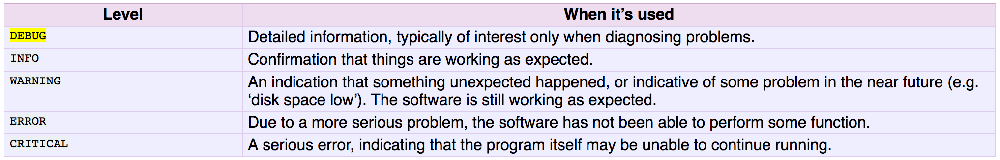

# logging-notes
Notes on using logging with python

## Usage
```
import logging
logging.basicConfig()
logger = logging.getLogger(__name__)
logger.setLevel(logging.INFO)

# Log to a file
handler = logging.FileHandler('main.log')
handler.setLevel(logging.INFO)
formatter = logging.Formatter('%(asctime)s - %(name)s - %(levelname)s - %(message)s')
handler.setFormatter(formatter)
logger.addHandler(handler)

logger.info('Here is some good info')
```

## Levels


## Sources
- https://docs.python.org/2/howto/logging.html
- https://fangpenlin.com/posts/2012/08/26/good-logging-practice-in-python/
