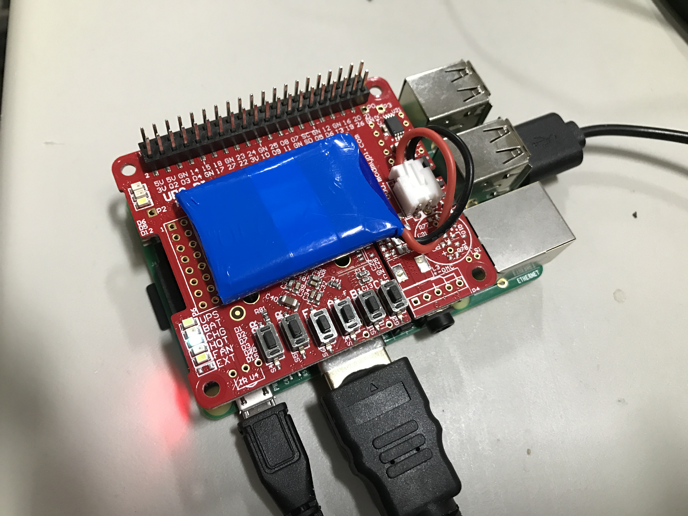

# ups-pico-notes
Notes on getting a ups pico integrated with raspberry pi


## Purchase
- https://www.modmypi.com/raspberry-pi/breakout-boards/pi-modules/ups-pico/?search=ups%20pic
- http://www.pimodulescart.com/shop/item.aspx?itemid=30&error=selectoptions

## Install
Start install script, come back in 30 minutes
```
./install.sh
```
Edit etc/modules
```
sudo nano /etc/modules
```
Make sure you see these:
```
i2c-bcm2708
i2c-dev
rtc-ds1307
```
Edit /etc/rc.local
```
sudo nano /etc/rc.local
```
Add in:
```
echo ds1307 0x68 > /sys/class/i2c-adapter/i2c-1/new_device
( sleep 4; hwclock -s ) &
```
Unplug power from pi, connect pico shield, power back on pi

## Test
Run pico status script
```
cd ~/PiModules/pico_status
python pico_status_hv3.0.py
```
Should output
```
***********************************
      UPS PIco HV3.0A Status       
***********************************
 
  UPS PIco Firmware.....: 18
  UPS PIco Bootloader...: 53
  UPS PIco PCB Version..: 41
  UPS PIco BAT Version..: LiPO (ASCII: S)
  UPS PIco BAT Runtime..: 1 MIN
  UPS PIco r232 State...: OFF
 
  Powering Mode.........: RPi POWERED
  BAT Percentage........: 45.3333333333 %
  BAT Voltage...........: 3.74 V
  RPi Voltage...........: 4.84 V
  NTC1 Temperature......: 24 C
  TO-92 Temperature.....: 02 C
  Extended Voltage......: 1.83 V
  A/D2 Voltage..........: 0.0 V
 
  PIco FAN Mode.........: DISABLED
  PIco FAN State........: OFF
  PIco FAN Speed........: 0.0 RPM
 
***********************************
         Powered by PiCo           
***********************************
```

## Configuration
- https://github.com/modmypi/PiModules/blob/master/doc/UPS-PIco.md

## Sources
- https://github.com/modmypi/PiModules/wiki/UPS-PIco-Installation
